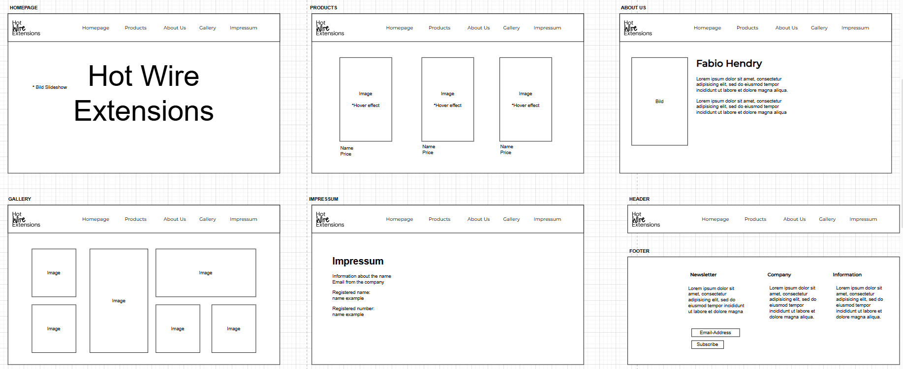

# Planung

## Projektdefinition
Ich werde eine Webseite machen für meinen Couseng, welcher als Designer tätig ist. 
Seine momentane Webseite könne m. (https://www.hotwireextensions.com/)
Ich denke nämlich, dass man bei solch einer Webseite sehr kreativ sein kann was einiges erleichtert und ich spannend finde. 

Für den Lauftext habe ich mir überlegt, ein kurzes Intro über ihn als Person zu schreiben und ansonsten noch eine kurze Beschreibung zu seinen Projekten und Produkten.
Für den Inhalt, welcher ich als Raster darstellen will mache ich eine Seite mit den Produkten und nutze ein Grid.

## Wireframes
Dieses Wireframe habe ich am Anfang vom Projekt erstellt, damit ich eine gewisse Vorlage und Idee habe wie ich es umsetzen kann. 

## Styleguide
Logo: Da ich die Webseite von meinem Couseng anders designe, habe ich das Logo schon und muss kein neues erstellen. So sieht es aus ->  

Schriftart: Für Titel sowie die Navbar etc möchte ich von Google Fonts die Schrift Monserrat brauchen.  

Farben: Für die Farben möchte ich eher schlichte Farben verwenden.  

## Template Seiten

## Inhaltsseiten

## Publikation